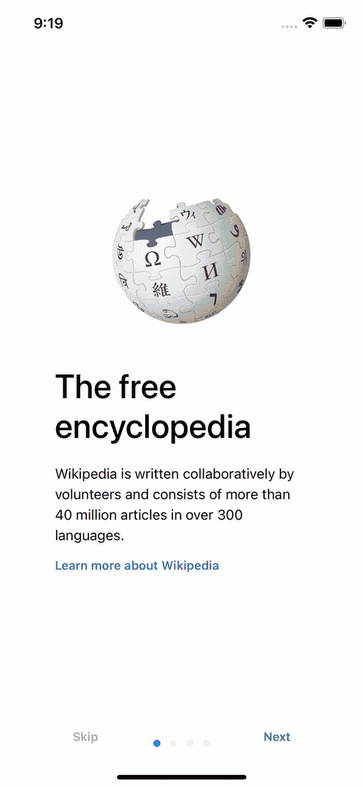

End-to-end Testing Package for Mobile Apps
==========================================

.. _readthedocs: https://e2e-mobile.readthedocs.io
.. _contributing guidelines: https://e2e-mobile.readthedocs.io/en/latest/contributing.html
.. _FAQ: https://e2e-mobile.readthedocs.io/en/latest/faq.html#python-setup

.. image:: https://img.shields.io/pypi/v/e2e-mobile.svg
    :target: https://pypi.org/project/e2e-mobile

.. image:: https://img.shields.io/pypi/l/e2e-mobile.svg
    :target: https://github.com/trinhngocthuyen/e2e-mobile/blob/main/LICENSE

``e2e-mobile`` is a Python package providing convenient setup for end-to-end testing in mobile apps. This package is the combined magic of Appium and Pytest. It helps us:

- Write tests once, for both platforms (iOS & Android).
- Write reusable & readable tests that can be scale to support complex use cases.

Installation
------------

``e2e-mobile`` is `available on PyPI (Python Package Index)
<https://pypi.org/project/e2e-mobile>`_. You can install with with ``pip``:

.. code-block:: console

   $ pip install --upgrade e2e-mobile

First time hearing ``pip``? Check this `FAQ`_.

Usage
-----

Kindly check out the related docs on readthedocs_:

- `Getting Started <https://e2e-mobile.readthedocs.io/en/latest/getting_started/index.html>`_

Documentation
-------------

Kindly check out the related docs on readthedocs_:

- `API Reference <https://e2e-mobile.readthedocs.io/en/latest/api/reference.html>`_

Contributing
------------

Refer to the `contributing guidelines`_ for how to contribute to this project.
