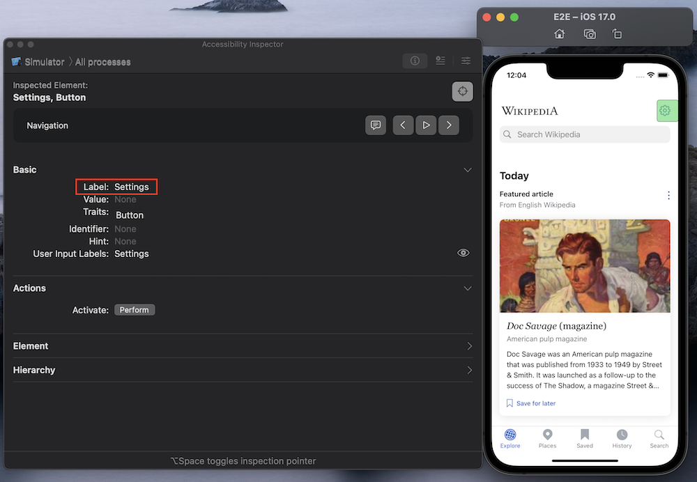
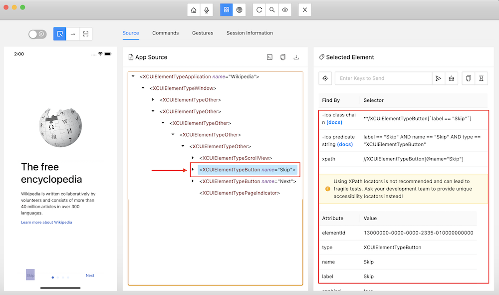
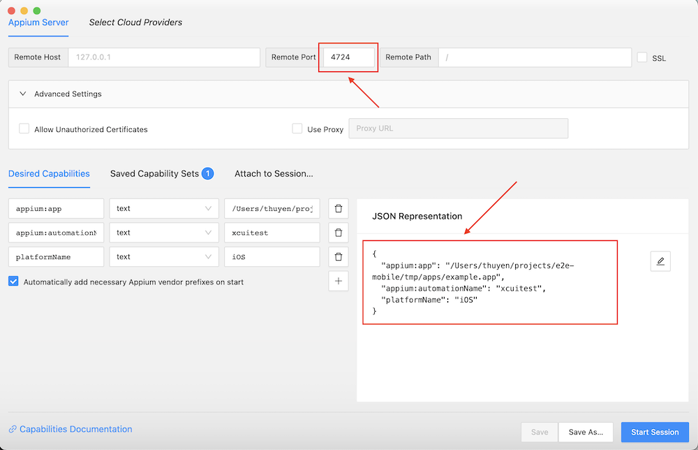

Inspecting Elements
===================

Using the Accessibility Inspector app
-------------------------------------

A simple approach to inspect app elements is using the Accessibility Inspector app.
When hovering over an element in the target app, the accessibilities show up in the inspector app.

Refer to `this article <https://bignerdranch.com/blog/auditing-your-app-for-accessibility>`_ for more details.

Using the Appium Inspector app
------------------------------

While the Accessibility Inspector app offers a very handy way without any extra setup, the result is not quite satisfactory at times. For instance, inspecting elements we cannot hover over is troublesome. Because of this limitation, it's difficult to understand the UI hierarchy.

An alternative is the `Appium Inspector app <https://github.com/appium/appium-inspector>`_. This app is maintained by Appium team. It has quite many cool features.

With this app, you can:

- *View the UI hierarchy* of the screen presenting on the app.
- *Search for elements* with a given id, xpath, class name, predicate string, and so forth.
- *Perform actions* with those matching elements.

Basically, what you interact with this inspector app is also what your test code should look like. Therefore, my recommendations are:

- First, try out the test steps with this inspector app.
- Then, formulate those steps with python code in your tests.

Starting a session in the Appium Inspector app
~~~~~~~~~~~~~~~~~~~~~~~~~~~~~~~~~~~~~~~~~~~~~~

There are some available tutorials about using this app.
The following steps are basic steps to start an inspector session.

**Step 1. Start the Appium server.**

If you already installed Appium (via ``npm``), just run ``appium`` or ``appium server`` on Terminal.

.. note::

    A small tip for you is to start the server on another port other than the default (4723). This way, if you run tests with ``e2e-mobile``, the session kick-started by ``e2e-mobile`` will not interfere your on-going inspector session in the Appium Inspector app.

    To start the server on another port (ex. 4724), run:

    .. code-block:: console

        $ appium server --port 4724

**Step 2. Specify the desired capabilities**

Open the Appium Inspector app and provide the desired capabilities.

The minimal capabilities include ``app``, ``automationName`` and ``platformName``. Following is an example.

.. code-block:: json

    {
        "app": "/Users/thuyen/projects/e2e-mobile/tmp/apps/Wikipedia.zip",
        "automationName": "xcuitest",
        "platformName": "iOS"
    }

For the extensive list of capabilities supported by Appium, refer to this doc: `Appium Desired Capabilities <https://appium.readthedocs.io/en/stable/en/writing-running-appium/caps>`_.

.. note::

    Remember to update the port (4724) correponding to the Appium server we started in step 1.

**Step 3. Start session**

Tap *"Start Session"* to kick-off your inspector session.

Dealing with non-trivial accessibility ids
------------------------------------------

There are cases in which the accessibility ids do not seem obvious. A typical example is an icon button without any text at all. Even worse, sometimes the accessibility ids are dynamic based on the displaying content. Using those indeterministic ids may result in test flakiness.

This is when other *element query strategies* comes to the rescue. One common choice is adopting ``xpath``. With ``xpath``, we can perform much more complex queries like:

- Searching for an element whose parent's label contains a specific string.
- Searching for the second element of type X.

For more use cases, refer to this cheatsheet: `Xpath cheatsheet <https://devhints.io/xpath>`_.
