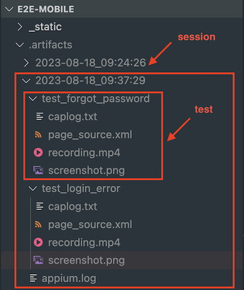

Troubleshooting
===============

Sometimes we wish to troubleshoot test failures (if occurred), or just review the test execution for the purpose of audit. Following are some resources that are useful for the troubleshoot.

Test artifacts
--------------

After finishing your tests (with either a success or a failure), the artifacts will be saved to the corresponding session artifacts.

.. note::

    A **test session** corresponds to each time you run ``pytest``. There could be more than one test running within a test session.

The artifacts of each run include:

- **Appium log** of the session.
- **Per-test artifacts**:
    - **Page source** (the UI hierarchy in xml format) of the app at the end of the test. You can use this xml to check the elements in the app at that time.
    - **Screenshot** of the app at the end of the test.
    - **Recording** of the app from the start to the end of the test.
    - **Captured log** of the test. Basically it resembles the logs observed in terminal.

The following image illustrates how test artifacts are structured in the artifacts directory.

