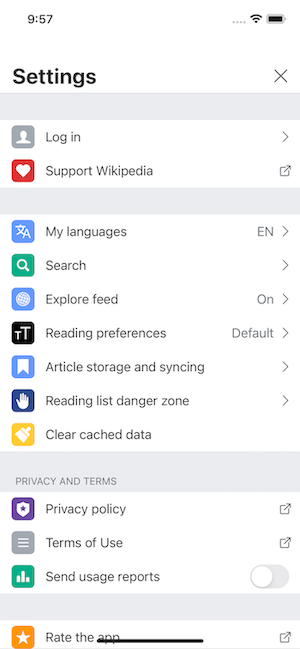

Writing Your First Test
=======================

Let's create a simple test.

For the sake of demonstration, we're going to use the Wikipedia iOS app for testing. In case you did not have the app under ``tmp/apps/Wikipedia.zip``, you can simply run ``e2e demo build``. This command clones the project and builds the app for you.

Let's say we are testing the Settings screen in the app.

Creating a test function
------------------------

First, create a new file called ``test_settings.py`` under ``tests/e2e`` directory.

In this file, write a test without doing anything at all.

.. code-block:: python

    def test_settings():
        pass

Then, try running this test. It should pass.

.. code-block:: console

    $ pytest tests/e2e/test_settings.py

So far, we have not specified anything related to the app. Hence, when running the test, you should not see the app being launched.

Using the ``tester`` fixture
----------------------------

Now, let's add ``tester`` to the arguments of the test method.
For type hints, we can specify its type (as ``Tester``) as follows:

.. code-block:: python

    from e2e_ext.core.tester import Tester

    def test_settings(tester: Tester):
        pass

``tester`` is a fixture provided by ``e2e-mobile``. With this fixture, the app shall be launched upon testing. You can try running the test again to verify this. From there, we can perform UI assertions or actions.

Writing UI assertions and actions
---------------------------------

The first thing we see when launching the app is the tutorial. Let's dismiss it by tapping on the "Skip" button:

.. code-block:: python

    def test_settings(tester: Tester):
        tester.ui.button('Skip').tap()

Most of the time, the text we see on the screen can be used as the accessibility id/label.
In some cases where the accessibility ids/labels do not seem obvious, we can just inpect the elements to know the value. Refer to :doc:`inspecting_elements` for more details.

By inspecting the elements, we know the accessibility id/label of the settings icon ⚙️ is "Settings". Tapping on this icon, we should see the Settings screen. In this screen, we expect to see some elements like "Log in", "My languages", "Explore feed".
The code for those actions and assertions are as follows:

.. code-block:: python

    def test_settings(tester: Tester):
        tester.ui.button('Skip').tap() # Dismiss the tutorial

        tester.ui.button('Settings').tap() # Tap the settings icon

        # Assertions: must see the setting items
        tester.ui.button('Log in').must_exist()
        tester.ui.button('My languages').must_exist()
        tester.ui.button('Explore feed').must_exist()

Now, let's run the test again.

.. code-block:: console

    $ pytest tests/e2e/test_settings.py

Congratulations 🎉! You have succeeded writing your first test.
